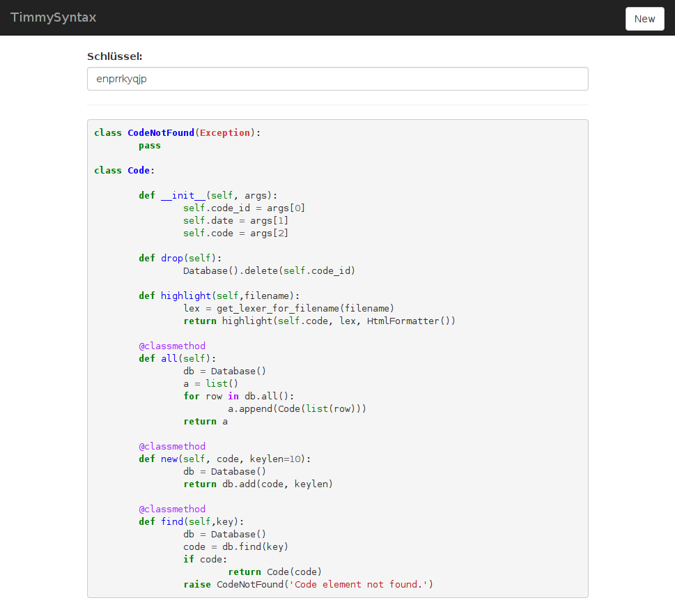

timmyPaste
===========

It representes only a poor pastbin clone.
Written in Python(3)-Flask with an SQLite backend.



Features
--------

* Simple deployment.
* Lightweight.
* Realtime syntax highlighting based on prefix.
* Private and public posts.

#####################
# ** Coming soon ** #
#####################

* *Full restfull api implementation*
* *Image upload*
* *URL truncation*
* *Expire of pastes*

Requirements
------------

* sqlite3
* pygments
* flask
* flask-restful
* flask-classy
* hamlish_jinja

**Note**

Before you are able to use it, you need to create the Database.
You only need to open a python shell an type the following:

```python
  import lib.db
  lib.db.Database().create()
```


Structure
---------

### route: /
```
  Show index page.
```

### route: /new
```
  Create new paste.
```

### route: /..key..[.suffix]
```
  Show paste if key is given.
  [.suffix defines the filename, which should be highlighted]
  Sample: 
    hdauoqqfb.py => Python
    hdauoqqfb.rb => Ruby

```

### route: /..key../raw
```
  Show paste if key is given in raw formate.
  Mime-Type: text/plain
```

### route: /api/
```
  This is only an experimental call. 
  It returns an all pastes, formatted as json.
```

Setup
----------

You could start them with gunicorn.
There is also an systemd service / socket file shipped.
You only need to replace your WorkingDir and username. 
It will start an GUnicorn on local:9000 or ::8000.

```bash
gunicorn app:app -w 1 -b 0.0.0.0:5000
```

or easier for development.

```bash
python app.py
```


